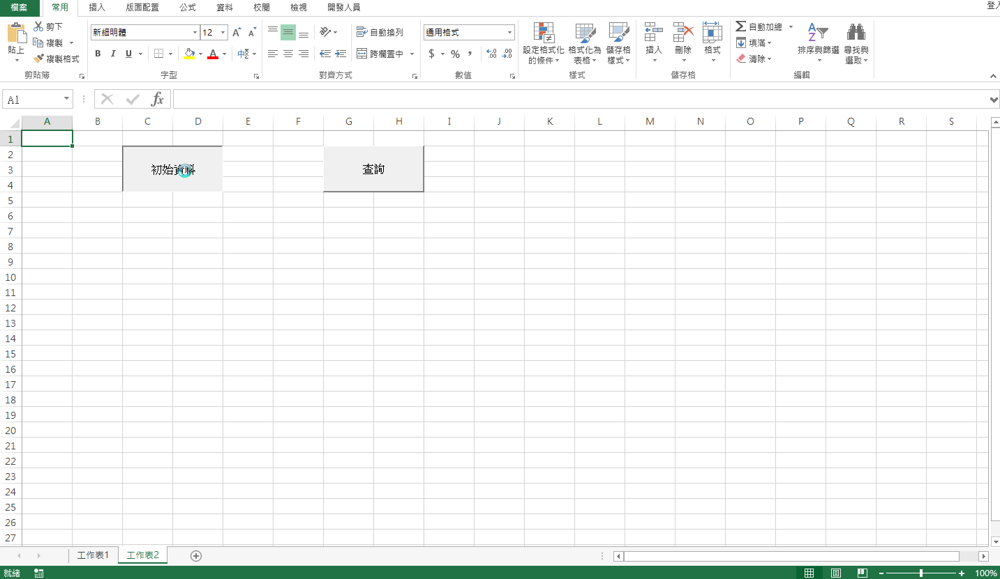

### data-fetch

> 用途：為了要隨時能知道所得稅法法條更新的狀況

> 使用vba，透過excel的巨集，將網頁中的表格(form)，拉進本機的excel檔案中

> 參考影片：
>- [Here1](https://www.youtube.com/watch?v=bd4-f5lo9F0)
>- [Here2](https://www.youtube.com/watch?v=ukWb7SYi5R8)

***

利用[全國法規資料庫的公佈欄](http://law.moj.gov.tw/News/news_result.aspx?SearchRange=G&k1=%E6%89%80%E5%BE%97%E7%A8%85%E6%B3%95)，得知所得稅法最新的狀況

gogo按鈕：是將公佈欄第一頁的資料儲存在工作表1中

查詢按鈕：把與所得稅法無關的資料刪除，放進工作表2中，並檢查有無最新的所得稅法消息

***

#### Demo

